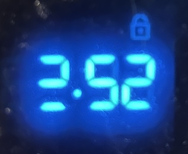

title: The Clock Problem
date: 2026-06-03 13:33:56
layout: post
---
New first post in 9 years... Ain't that something?

Anyway, this is going to be a post about my new project at https://github.com/dan24678/clock-problem

This project started when I noticed that one of the LEDs on my oven's clock had broken:

I found myself wondering if the LED which broke was the one which was illuminated most frequently. After asking myself that question, I realized what a great coding challenge that would be. Unfortunately, I wasn't interviewing any candidates as part of my job at the time, so I just kind of sat on the idea for almost a year.

Then the other day, I decided to give it a try myself and coded it out. You can see my implementation on Github at the URL above. Anyway, it turns out that the LED which burned out was tied for second place in terms of most frequently used.

After coding the challenge myself, I decided to have Copilot/Claude attempt it.

My first prompt I didn't ask it to generate any code, but I instead asked it for the direct outputs that I ask for as part of the challenge -- namely a list of all 28 LEDs used to show the time, sorted by the number of minutes each LED is turned on in a 12-hour period. The list it output was exactly correct but was inexplicably missing one of the LEDs. Once I pointed that out, it gave me the correct, full list.

There's a valuable lesson right there:  When using AI to generate some data for you (or any task really) make sure that you have the tools to validate the response that it gives you. By receiving just the data in isolation, there was no code for me to review to double check its logic. Instead I would have been forced to take the data it presented at face value. Of course, you can always use AI to check its own work, either directly by asking it to do so, or indirectly by asking it for the same data but making it use a different approach.

The next thing I tried was having Claude generate the actual code to satisfy the coding challenge. You can see the results of that here: https://github.com/dan24678/clock-problem-ai

It is interesting to compare the results of my manual implementation with Claude's. The first, most glaring difference is the effort involved: my implementation took about an hour versus 2 minutes for Claude.

Was my implementation any better? I actually do prefer mine. I like the abstractions that I introduced and prefer the way in which I split the display logic from the calculation logic. I was curious about which Claude preferred so I ask him to compare the two code bases. I'm not sure if this is a surprising answer or not, but he preferred his own. He noted that "clock-problem mixes display logic into the calculation path, while clock-problem-ai keeps the simulation and output more separate" -- which is a statement I don't entirely agree with.

But I suppose that's how Code Reviews often work. Two coders bringing their personal perspectives to bear against an often subjective and intangiable judgement about which of two alternatives is preferable.

Anyway, see the full comparison here: https://github.com/dan24678/clock-problem-ai/blob/main/comparison.md

The next step I intend to take with this project is leveraging Claude to add a React-based view layer to my code to simulate the look of an old wood-paneled vintage clock. I'm curious to see how easy this will be to implement and how well Claude will follow React best practices.